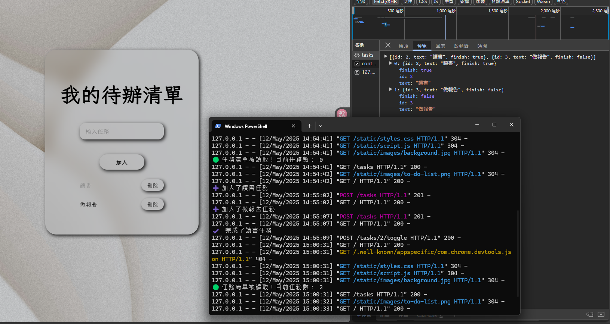

# **待辦清單 To-Do List Web App ( Flask )**

這是 To-Do List 專案練習的完整版本，包含前端和後端。

前端使用純 HTML、CSS 和 JavaScript，而後端則是用 Python (Flask) 實現。

可以處理使用者輸入、與資料庫互動、提供 API 等功能

<br>

##  技術

-  HTML：構建網頁的基本結構。
  
-  CSS：設計網頁的樣式與版面。
  
-  JavaScript：實現前端互動功能，如新增、刪除任務、切換完成狀態及後端資料同步。
  
-  Python（Flask）：建立後端伺服器與 API，負責處理資料傳輸與儲存。

<br>

##  功能介紹

-  新增任務：使用者可在輸入框中輸入任務內容，點擊「加入」按鈕，將任務加入清單中。
  
-  刪除任務：每個任務旁有刪除按鈕，可點擊將任務從清單中移除。
  
-  完成任務：點擊任務名稱來切換其完成狀態，已完成的任務會顯示刪除線。
  
-  所有任務資料會儲存在後端（記憶體中）
  
-  資料目前未永久保存（重新啟動伺服器會清空）

<br>

## 畫面預覽

### 主畫面


### 新增、刪除、切換完成畫面


### 後端儲存資料成功畫面


<br>

##  專案收穫

這個專案是我練習前後端整合的小型作品，過程中我：

1. 實作了一個 Flask 後端 API，讓前端可以動態新增、刪除並取得任務資料
  
2. 練習了如何使用 JavaScript 的 `fetch()` 方法與後端 API 溝通
  
3. 學會如何設計 RESTful API 路由，使用不同 HTTP 方法（GET、POST、DELETE）
  
4. 建立了前後端資料互動的基本概念，也為日後串接資料庫與部署做準備

<br>

##  運行專案

### 1. 安裝檔案

```bash
git clon https://github.com/harvey0521/To-Do-List-Web-Flask.git
```

### 2. 建立 & 啟用虛擬環境

```bash
cd To-Do-List-Web-Flask
python -m venv venv
.\venv\Scripts\activate
```

### 1. 安裝相依套件

```bash
pip install -r requirements.txt
```

### 2. 啟動 Flask 伺服器

```bash
python app.py
```
